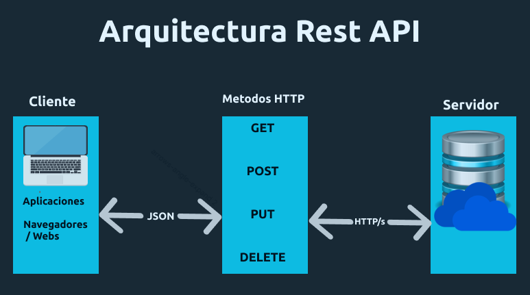
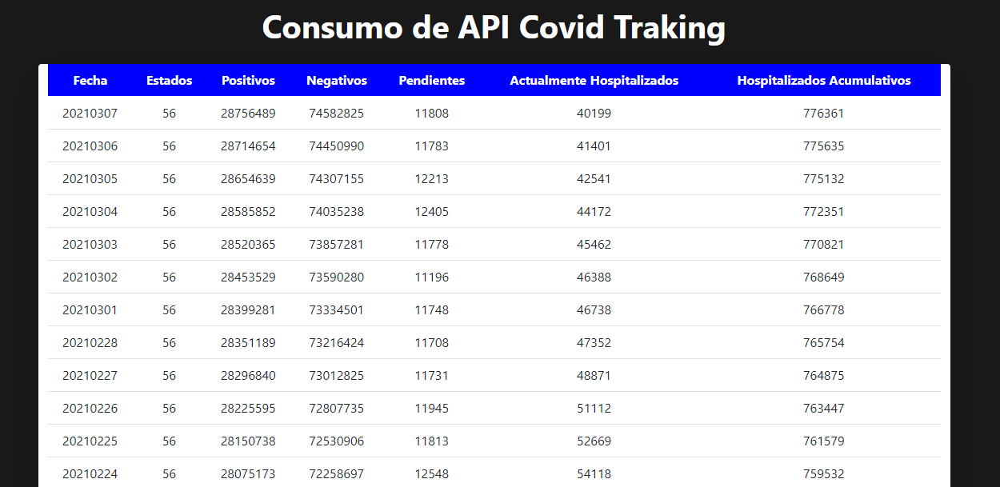

# Consumo de una API Rest 
La API usada es **[Covid Traking](https://api.covidtracking.com/v1/us/daily.json)**, la finalidad de este ejemplo es poder **obtener** y **mostrar** la informacion sobre los **contagios** y **hozpitalizaciones**, que se encuentran en esta API.

##  Fetch API
El uso de Fetch API, nos ayuda a tener una interaccion con un cliente para consumir recursos de forma asíncrona y poder obtener datos.

## Arquitectura Rest

<p aling="center">
    
</p>

**¿Que Obtendremos de la API?**
<br>De la API Covid Traking obtendremos la informacion de **Fechas, Estados, Casos: (Positivos, Negativos, Pendientes, etc.)** desde el JSON.


## Herramienta Extra
**Bootstrap:** Para crear la tabla en donde se ira agregando toda la informacion que se obtenga desde la API.


## Métodos y Proceso

* 1.Creacion de la variable que almacenara la URL de la API.<br>
```js
let url = 'https://api.covidtracking.com/v1/us/daily.json';
```
* 2.Invocamos el método `fetch` y como parametro de pasamos la variable que contiene la API, por defecto agregara el metodo HTTP `GET` .<br>
```js
fetch(url)
```

* 3.Incluir el método de promesa `then()`<br>
```js
// Haciendo uso de las promesas(promises)

    // llamnado al metodo then, para obtener la respuesta, convirtiendolo a datos en formato JSON
.then(response => response.json())
  // leyendo el objeto data, llamando a la funcion mostrarDatos para mostrar la informacion
.then(data => mostrarDatos(data))
```

* 4.Incluir el método `catch()` y  se ejecutará si se llega a producir un error a la hora de invocar la API.<br>
```js
.catch(error => console.log(error))
```
<br>

**Obteninedo los datos de la API**

* 5.En el archivo html se debera de agregar un container el cual debera tener un id especifico, ya que es donde recibiremos la informacion desde la API.<br>
```html
<tbody id="data"></tbody>
```

* 6.Se necesitara crear la funcion `mostrarDatos` que previamente se habia asignado y dentro de la funcion se creara un template en js, para posterioremete asignar ese cuerpo al archivo HTMl para mostrar la informacion.<br>
```js
body += `<tr><td>${data[i].date}</td>
                    <td>${data[i].states}</td>
                    <td>${data[i].positive}</td>
                    <td>${data[i].negative}</td>
                    <td>${data[i].pending}</td>
                    <td>${data[i].hospitalizedCurrently}</td>
                    <td>${data[i].hospitalizedCumulative}</td></tr>`;
```
* 7.Implementar `innerHTML` para agregar los datos que existen en el template `body` para enviar datos a un id en especifico mediante la manipulacion del DOM.
```js
document.getElementById('data').innerHTML = body;
```
<br>

## **[Demo](https://cov-traking.netlify.app/)**

<p aling="center">
    
</p>